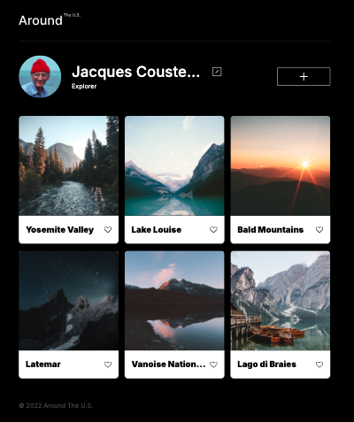
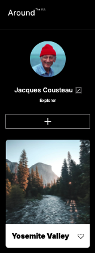

# Project 3: Around The U.S.

### Overview

- Intro
- Figma
- Images

**Intro**

This project was made so all elements are displayed correctly on different screen sizes from 320px to beyond 1500px. The webpage scales smoothly without horizontal scrolling at all resolutions for desktop, tablet, and smaller mobile devices. It allows users to showcase their travel photos with functionality to edit user title/description, like photos, and add more photos to their gallery. Technologies used in this project were HTML, CSS, Figma, GitBash, and image compression. Flexbox and Grid layout were combined to create responsive design.

Plans for improving the project:

- Mapping functionality
- Browsing photos by location
- Collapsible comment section displaying users avatars

[Link to project on GitHub Pages](https://gcleonio.github.io/se_project_aroundtheus/)

**Figma**

[Link to the project on Figma](https://www.figma.com/file/ii4xxsJ0ghevUOcssTlHZv/Sprint-3%3A-Around-the-US?node-id=0%3A1)

**Images**

<!-- Note: I have not included the video because I'd like to fix corrections before recording. -->
